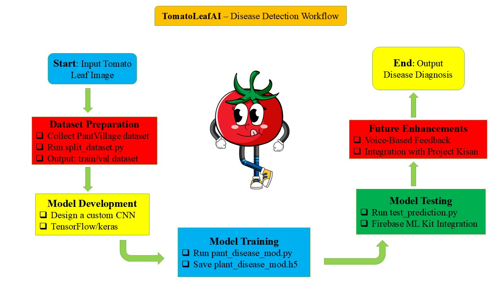

# TomatoLeafAI

TomatoLeafAI is a deep learning image classifier to detect diseases in tomato plant leaves. It uses a custom Convolutional Neural Network (CNN) to classify images into Early Blight, Late Blight, or Healthy categories. This project is a part of **Project Kisan** – an AI initiative to assist farmers with crop disease detection and other services.

## Features

- Detects:
  - Early Blight
  - Late Blight
  - Healthy Leaves  
- CNN model trained with high accuracy  
- Deployment-ready for mobile (TensorFlow Lite) and cloud (Firebase)  
- Simple Python code for learning and customization

## Tech Stack

- Python 3
- TensorFlow / Keras
- OpenCV
- tqdm
- Flask

## Folder Structure

```text
project-kisan-disease/
├── raw_tomato_dataset/
│   ├── Tomato___Early_blight/
│   ├── Tomato___Late_blight/
│   └── Tomato___healthy/
├── dataset/
│   ├── train/
│   └── val/
├── test_images/
│   └── test_image.jpg
├── images/
│   └── tomatoleafai_workflow.jpg
├── static/
│   ├── uploads/
│   └── style.css
├── templates/
│   └── index.html
├── app.py
├── plant_disease_model.py
├── test_prediction.py
├── plant_disease_model.keras
├── requirements.txt
└── split_dataset.py
```

## Model Workflow



## How It Works

1. Upload an image of a tomato leaf using the web interface.
2. The model predicts the disease class.
3. Displays the result and treatment info (if available).

## Getting Started

### Clone the Repo

```bash
git clone https://github.com/yourusername/TomatoLeafAI.git
cd TomatoLeafAI
```

### Install Requirements

```bash
pip install -r requirements.txt
```

### Prepare Dataset

Download and place folders inside `raw_tomato_dataset/`:

- Tomato___Early_blight/
- Tomato___Late_blight/
- Tomato___healthy/

Then run:

```bash
python split_dataset.py
```

### Train the Model

```bash
python plant_disease_model.py
```

### Start the Flask App

```bash
python app.py
```

Go to `http://127.0.0.1:5000` in your browser.

### Optional: Test Prediction from CLI

Add a leaf image in `test_images/`, update path in `test_prediction.py`, and run:

```bash
python test_prediction.py
```

## Project Kisan

TomatoLeafAI is a key module of Project Kisan for Google Hackathon 2025. The project empowers small farmers using AI tools.

Modules in development:

- Disease Detection [Done]
- Market Price Insights [In progress]
- Scheme Finder [In progress]
- Multilingual Voice Assistant [In progress]

## Contact

- Email: (mailto:ankitabcd1718@gmail.com)  
- GitHub: [github.com/ankit-prabhavak](https://github.com/ankit-prabhavak)  
- LinkedIn: [linkedin.com/in/ankit-prabhavak](https://linkedin.com/in/ankit-prabhavak)
